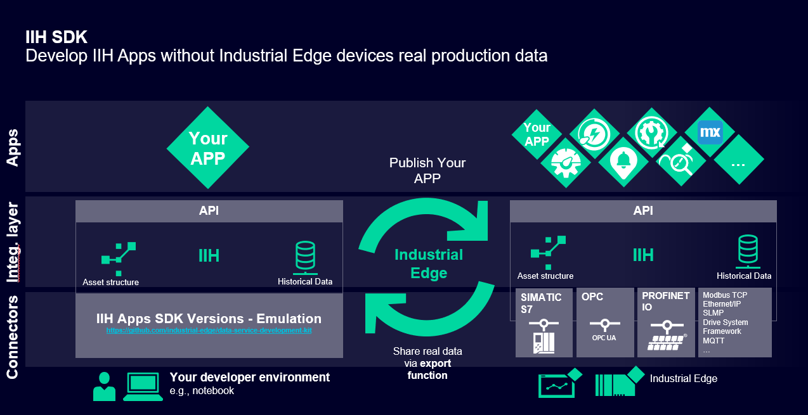
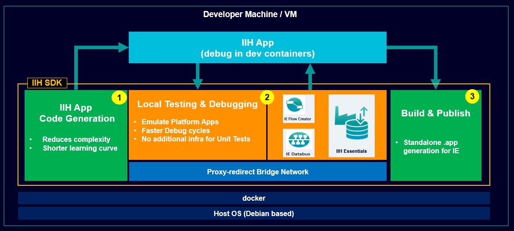
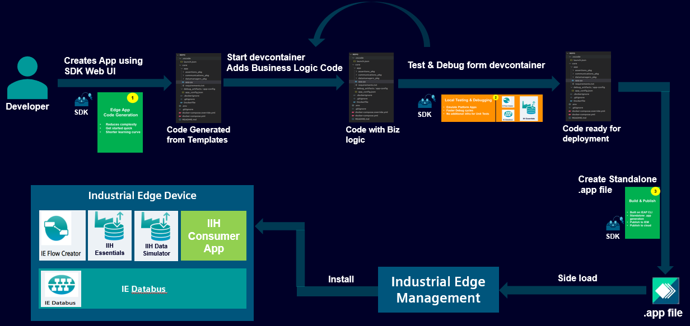

# IIH Software Development Kit

Welcome to the Industrial Information Hub Software Development Kit (IIH SDK).

Your Developer Companion to guide you in the complete app development lifecycle. IIH SDK speed's up and enhances the overall app development experience on Siemens Industrial Edge Platform.



The IIH SDK speeds up and enhance the entire development lifecycle of IIH apps from creation to deployment. This allows the developer to focus more on the business logic and offload the app creation, generation and deployment to SDK.

You can develop apps on your development machine/vm without a need of a physical Industrial Edge device or Industrial Edge Management. Additionally, SDK provides a data simulator to generate mock data for app testing and debugging.


This repository contains the documentation providing details of SDK, how-to setup and manage the SDK and how-to use the app workflows with examples. Please use the contents section below to navigate the documentation.

## Contents
- [IIH Software Development Kit](#contents)
    - [What SDK provides](#what-sdk-provides)
    - [Core Components](#core-components)
    - [Setup and Manage IIH SDK](#setup-and-manage-iih-sdk-on-developers-machinevm)
        - [Requirements](#requirements)
        - [Prerequisites](#prerequisites)
        - [How to Install](#how-to-install)
        - [How to Start](#how-to-start)
        - [How to Stop](#how-to-stop)
        - [How to Uninstall/Remove](#how-to-uninstallremove)
    - [IIH App Workflows through example](#iih-app-workflows-through-example)
        - [Create App](#create-your-app)
        - [Test App](#test-you-app)
        - [Deploy App](#deploy-your-app)
    - [More Examples](#more-examples)
    - [Current Capabilities](#current-capabilities)
    - [Limitations](#limitations)
    - [What's new](#whats-new)
    - [Community](#community)
    - [Contact us](#contact-us)
    - [Contribution](#contribution)
    - [Licence and Legal Information](#licence-and-legal-information)
- [IIH Mendix Integration](#iih-mendix-integration)


## What SDK Provides

The IIH SDK addresses the pain points associated with traditional development approaches. The key value add is given below.

- **Speeding up App Development:**
  The SDK accelerates app development through efficient Code Generation, allowing developers to focus on the core business logic.

- **App Artifact Generation:**
  Developers save time by leveraging automated app artifact generation, eliminating the manual effort required in configuring development environments.

- **Overhead-Free Configurations:**
  SDK mitigates the overhead of complex configurations, providing a more streamlined and developer-friendly experience.

- **Automated Deployment Builds:**
  Automation of the .app build process ensures consistency and reliability in the application packaging phase.

- **Optimizing Resource Utilization:**
  The SDK optimizes resource utilization, ensuring efficient use of computing resources during both development and execution.


## Core Components

The SDK offers 3 major capabilities which not only ease up the app development process but also makes it very fast and efficient.



### 1. Create Your App - IIH App Code Generation
   - Faster development through code generation (templates, libraries).
   - Wraps the runtime dependencies and guides developers to add business logic in simple steps.

### 2. Test you app - Local Testing & Debugging
   - Efficient testing and debugging by emulating device services.
   - Enables automation of unit tests in the development environment.
   - Provides live metrics of dependency resource utilization.

### 3. Deploy your app - Build & Publish
   - Optimal packaging for delivery or deployment to IEM.
   - Speeds up overall development time and enhances the app development experience.

## Setup and Manage IIH SDK

The SDK is currently packaged as an installable software on a debian based machine/vm. The installation is made very easy through a managing script. Please follow the steps below for installation.

### Requirements

- Debian based PC or VM.
    - Min. 2 core CPU
    - 8GB RAM
    - 100GB HDDz
    - No Graphic Card required
- Internet access needed (to pull installation and base images from dockerhub)
- Chrome Browser (Tested on : 122.0.6261.129 (Official Build) (64-bit) (cohort: Stable))

### Prerequisites
 
- Please make sure Docker is installed and the local user is added to Docker User Group. [Instruction provided here.](https://docs.docker.com/engine/install/linux-postinstall/#configure-where-the-docker-daemon-listens-for-connections)

- One of the services of IIH SDK connects to the deamon over 2375 port. Please make sure the 2375 port is exposed following the steps given below.

1. Create `daemon.json` file in `/etc/docker`:

        {"hosts": ["tcp://0.0.0.0:2375", "unix:///var/run/docker.sock"]}

2. Add `/etc/systemd/system/docker.service.d/override.conf`

        [Service]
        ExecStart=
        ExecStart=/usr/bin/dockerd


3. Reload the systemd daemon:

        systemctl daemon-reload

4. Restart docker:

        systemctl restart docker.service

- Install make using the command below.


        sudo apt install make


### How to Install
 
- Clone the [IIH SDK](https://github.com/industrial-edge/iih-sdk) repository to your system and navigate into the repo:
 
``` cmd
git clone https://github.com/industrial-edge/iih-sdk.git
```
``` cmd
cd ./release-v-1-0/
```
 
- Provide execute permissions to the iih-sdk.sk manager script. 
``` cmd
sudo chmod +x iih-sdk.sh
```
 
- To install the IIH SDK run the below command.
``` cmd
./iih-sdk.sh install
```
You should observe images being pulled from dockerhub. If incase you observe any issues here, please check the internet access.

### How to Start


- To start the IIH SDK,  navigate into the cloned repository directory and run the below command.
``` cmd
./iih-sdk.sh start
```

Please type in the URL in your Chrome browser to access the web user interface.

``` browser
http://localhost:48080
```

### How to Stop

- To stop the IIH SDK, navigate into the cloned repository directory and run the below command.
``` cmd
./iih-sdk.sh stop
```

### How to Uninstall/Remove
- To Uninstall/remove the IIH SDK,  navigate into the cloned repository directory and run the below command.
``` cmd
./iih-sdk.sh remove
```

Mana

## IIH App Workflows through example

A overview of the app developer journey using the IIH SDK is given below. 



Let's go through the above journey by creating a 'Hello World' app and observe the end-to-end app development workflows.

### [**Create Your App**](./docs/001_pages/02_create_app/01-Create-Workflow.md)
   - Faster development through code generation (templates, libraries).
   - Wraps the runtime dependencies and guides developers to add business logic in simple steps.

### [**Test you app**](./docs/001_pages/03_test_app/02-Test-Workflow.md)
   - Efficient testing and debugging by emulating device services.
   - Enables automation of unit tests in the development environment.
   - Provides live metrics of dependency resource utilization.

### [**Deploy your app**](./docs/001_pages/04_deploy_app/03-Deploy-Workflow.md)
   - Optimal packaging for delivery or deployment to IEM.
   - Speeds up overall development time and enhances the app development experience.

After successfully testing and debugging the app and generating the `.app` file, please follow these steps for deployment:

1. **Upload the `.app` File to IEM:**
   - Locate the `.app` file in the release folder inside the app workspace. for further information on deploy workflow please go to this [link](./Workflows/03-Deploy-Workflow.md)
   - Go to IEM and upload the `.app` file.

2. **Deploy to IED:**
   - After successful deployment on IEM management, install the application directly to IED.
   - Ensure that IED is in the network of IEM and has sufficient space for the application.

3. **Installation on IED:**
   - Install the application on IED.

4. **Verification on IED:**
   - Go to IED to verify if the installation was successful.

Voila! The app is now working on IED.

## More Examples
### Example 1

Triangular wave using random data - provided by the Development Kit - Create an application without any service and form a **triangular** wave using **streamlit**.<br>
Access the example [here](./docs/002_example_apps/001_Example_001/001_Example_001.md)

#### Expected Result

 

### Example 2

Triangular wave using databus as service - provided by the Development Kit - Create an application to form a **triangular** wave using **Databus** and **flow creator** as service and get data through them. The data represented in a triangular wave form is created by using **streamlit**. <br>
Access the example [here](./docs/002_example_apps/002_Example_002/002_Example_002.md)

#### Expected Result 


## Example 3

Triangular wave using IIH essentials - provided by the Development Kit - Create an application to form a **triangular** wave using **IIH essentials** and **IIH Simulator** as service to get data from **PLC** and visualize that data using **streamlit.**
<br>
Access the example [here](./docs/002_example_apps/003_Example_003/003_Example_003.md)

#### Expected Result


### Current Capabilities

As of now, the IIH SDK provides the following capabilities:

- **App Generation for Python:**
  Developers can generate Python-based applications with ease, leveraging the power and flexibility of the Python programming language.

- **Emulation with IIH Apps:**
  The SDK allows developers to emulate and test their applications seamlessly within the IIH ecosystem.

- **Automated Packaging:**
  The packaging process is automated, simplifying the deployment of applications to the Industrial Edge.


## Limitations

The IIH SDK is launched with the following restrictions.
- Language Restriction: Presently, the SDK  exclusively supports the creation of Python language applications.
- Service Customization Limitation: The ability to integrate custom services is not available in the Development Kit.
- Deployment to IEM is not available in the launched version.


## What's New

<details>
  <summary style="font-weight: bold; font-size: x-large;">v1.0.0 - 2024-03-20</summary>
  </summary>
  <h3>Launched with the below features/capabilities</h3>
  <ul>
    <li><h4>App Generation for Python</h4>
    Developers can generate Python-based applications with ease, leveraging the power and flexibility of the Python programming language.</li>
    <li><h4>Emulation with IIH Apps </h4>
    The SDK allows developers to emulate and test their applications seamlessly within the IIH ecosystem.
    </li>
    <li><h4>Automated Deployment</h4>
    The packaging process is automated, simplifying the deployment of applications to the Industrial Edge.</li>
    <li><h4>App Workflow through example</h4></li>


</details>

## Community

Please ask questions in the [Industrial Edge support forum](https://forum.industrial-edge.siemens.cloud/).

## Contact us

**** Check with Norman to create a support channel. ****

For support requests contact your regional contact person. They take care of your concerns and give you feedback.

## Contribution

Thank you for your interest in contributing. Anybody is free to report bugs, unclear documentation, and other problems regarding this repository in the Issues section.
Additionally everybody is free to propose any changes to this repository using Pull Requests.

If you haven't previously signed the [Siemens Contributor License Agreement](https://cla-assistant.io/industrial-edge/) (CLA), the system will automatically prompt you to do so when you submit your Pull Request. This can be conveniently done through the CLA Assistant's online platform. Once the CLA is signed, your Pull Request will automatically be cleared and made ready for merging if all other test stages succeed.

# Licence and Legal Information

Please read the [Legal information](LICENSE.md) documentation.

# IIH Mendix Integration

Please Refer to the  [IIH Mendix integaration](./docs/001_pages/home/09_iih_mendix_integration/09-IIH-mendix.md) documentaiton for details.


- IIH Copilot and IIH Mendix

   - [IIH-Copilot documentation](./00-What-is-SDK.md)