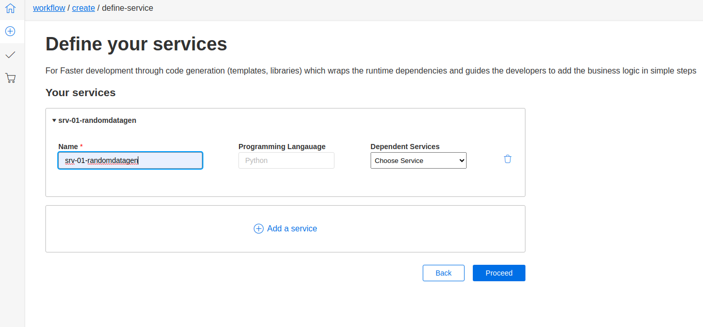
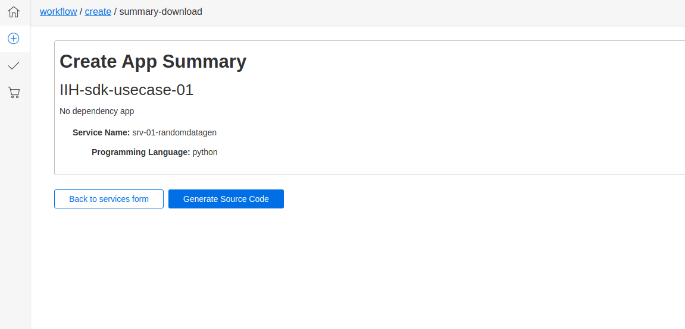

## Create Workflow

### Create Your Application

1. **Name:**
   - Enter your app name.
   - *Name is required.*

2. **Description:**
   - Enter your app description.
   - *Description is required.*

3. **Buttons:**
   - **Reset:** Clears the entered information.
   - **Proceed:** Takes you to the next step.

### Define Your Services

1. **Your Services:**
   - Add a service by clicking on "Add a Service."

2. **Service Details:**
   - **Name:** Enter the name of the service.
   - **Programming Language:** Select the programming language (e.g., Python).

3. **Dependent Services:**
   - Choose services from:
     - In Core: IIH Essentials
     - In Platform: Databus
   - Select multiple services as needed.

4. **Buttons:**
   - **Back:** Returns to the previous step.
   - **Proceed:** Moves to the next step.

### Create App Summary

1. **Summary:**
   - Displays app name and description.
   - Lists services with their details.

2. **Buttons:**
   - **Back to Services Form:** Returns to the services form for any modifications.
   - **Generate Source Code:** Proceed to generate source code.

### Generate Source Code

1. **Zip File:**
   - Generates a zip file containing the required source code.

