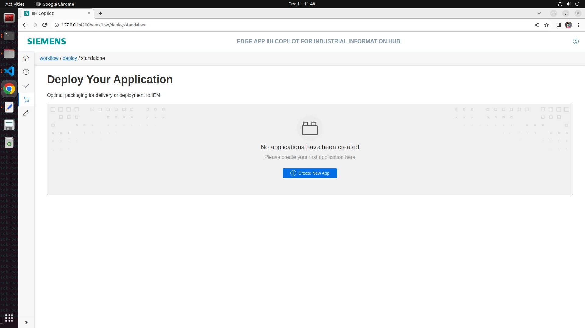
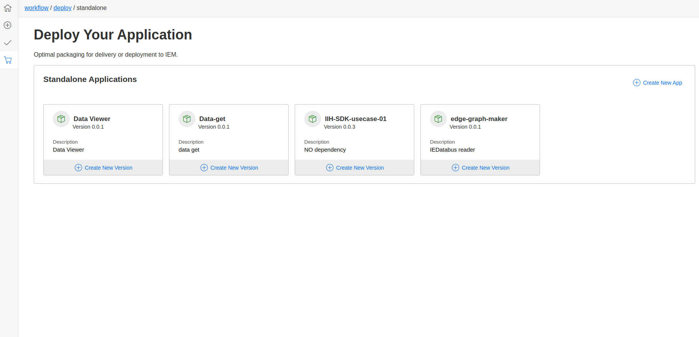
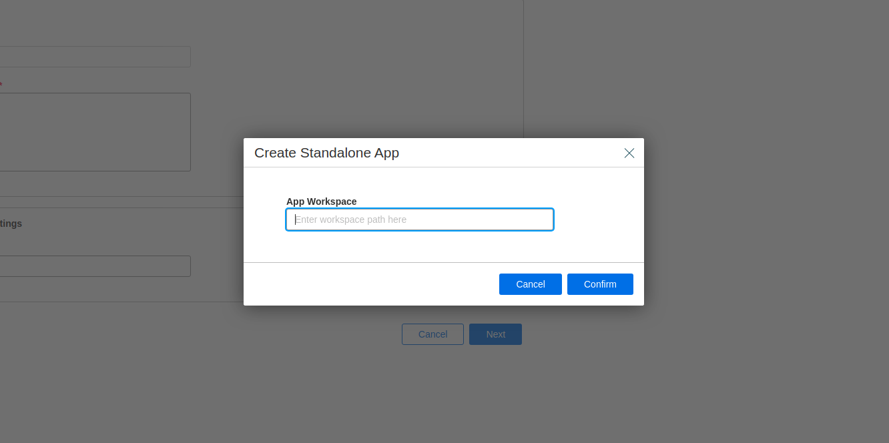
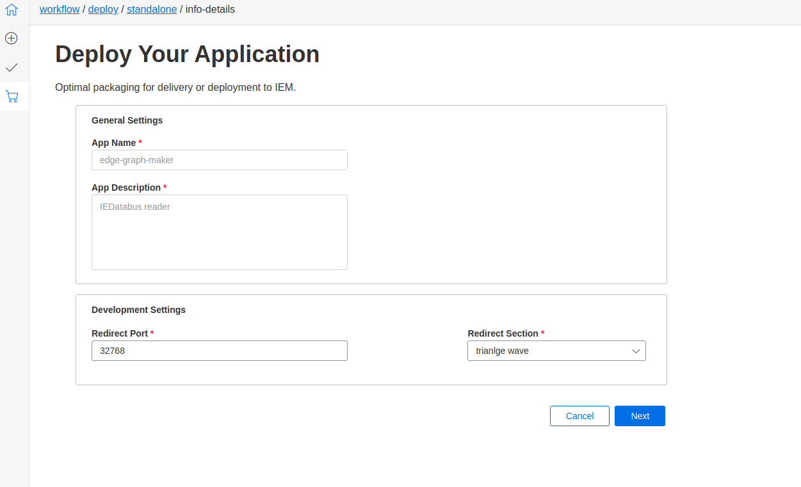
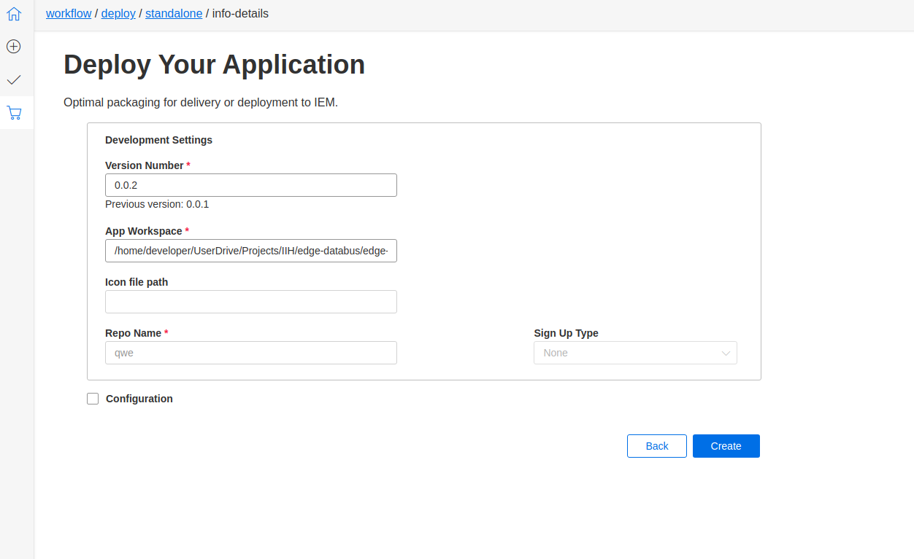
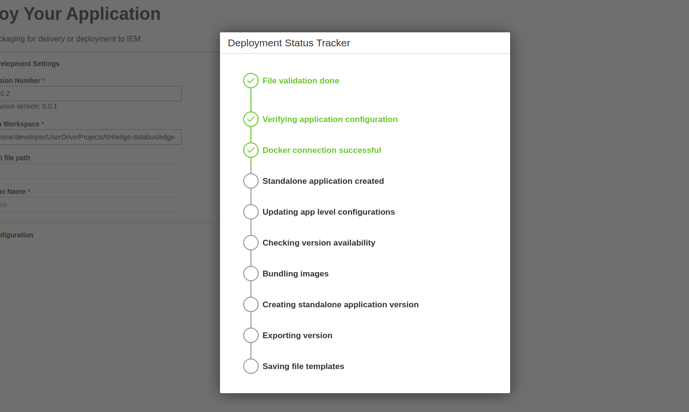
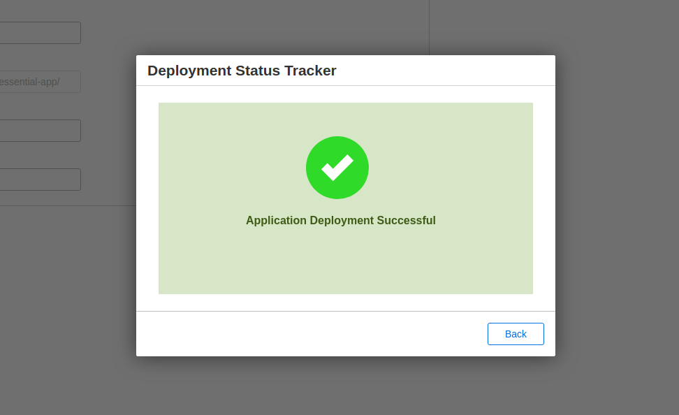

# Deploy Workflow

After the successful testing and debugging of the application, the next step is the Deploy Workflow. This workflow allows you to generate the .app file and push it to Edge Management. Once deployed, the application can be installed on any edge device connected to the network, seamlessly transitioning from the local development environment to live deployment.

## Workflow Steps

1. **Build and Test:**
   - After thorough testing and debugging, proceed to the deploy workflow.

2. **Create New App:**
   1. When no app is created
      - Click on "Create New App" to initiate the deployment process.
   

   2. When apps are already there
      - Click on "Create New App" in the top right corner of the screen.

3. **App Workspace Path:**
   - Provide the app workspace path where the `metaconfig.json` file is located.

4. **Verification:**
   - Once the app workspace path is provided, the workflow will verify the details.

5. **Deploy Workflow Page:**
   - Upon successful verification, the deploy workflow page opens.

## Deploy Your Application

### General Settings

1. **App Name:**
   - Specify the name of your application.

3. **App Description:**
   - Provide a brief description of your application.

### Developer Settings

1. **Redirect Port:**
   - Set the redirect port within the range of 32768 to 60999.

5. **Redirect Section:**
   - Select the service name for redirection.

3. **Version Number:**
   - Set the version number in the format 0.0.0.

2. **App Workspace Path:**
   - The app workspace path is pre-specified based on the provided path during workflow initiation.

1. **Icon File Path:**
   - (Future Feature) Icon file path will be available in the next phase.

2. **Repository Name:**
   - Select the repository for your application.

3. **Sign-Up Type:**
   - (Phase 2 Feature) Specify the sign-up type for your application.

### Configuration
   - Default app configuration is set, but you can customize by clicking the checkbox and adding custom configurations.

### Deploy App Stages

1. **File Validation:**
   - Validate the files to ensure correctness.

8. **Verifying Application Configuration:**
   - Confirm the correctness of the application configuration.

9. **Docker Connection Successful:**
   - Ensure successful connection with Docker for image deployment.

10. **Standalone Application Created:**
    - Creation of a standalone application for deployment.

11. **Updating App Level Configurations:**
    - Update configurations specific to the application.

12. **Checking Version Availability:**
    - Ensure the availability of the specified version.

13. **Bundling Images:**
    - Bundle the required images for deployment.

14. **Creating Standalone Application Version:**
    - Create a standalone version of the application for deployment.

15. **Exporting Version:**
    - Export the application version for deployment.

16. **Saving File Templates:**
    - Save templates and configurations for future reference.

17. **Application Creation Complete:**
    - Upon successful completion of all stages, your application is now ready for deployment.

### End of te above steps, the `.app` file in created in the release folder in your app workspace.

### Now your application is ready for importing to IEM.
