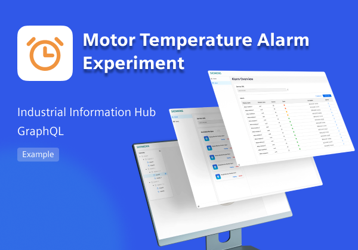
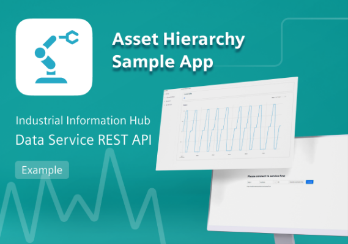
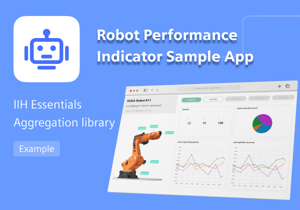

# IIH Mendix Integration Overview

## Introduction

The sample apps of IIH Mendix Integration show the capability that Mendix users can create their own business use cases or dashboards based on IIH Essentials & IIH Semantics, processing data from edge devices to applications.

### IIH GraphQL Example - Motor Temperature Alarm Sample App
https://marketplace.mendix.com/link/component/215224

### Data Service REST API Example - Asset Hierarchy Sample App
https://marketplace.mendix.com/link/component/217777

### IIH Essentials Aggregation Library Example - Robot Performance Indicator Sample App
https://marketplace.mendix.com/link/component/218704

