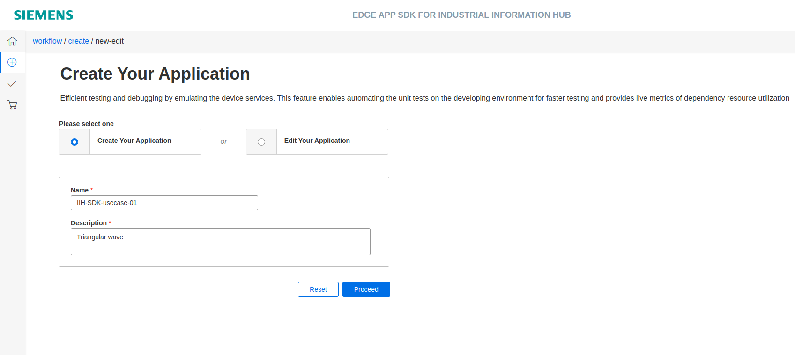
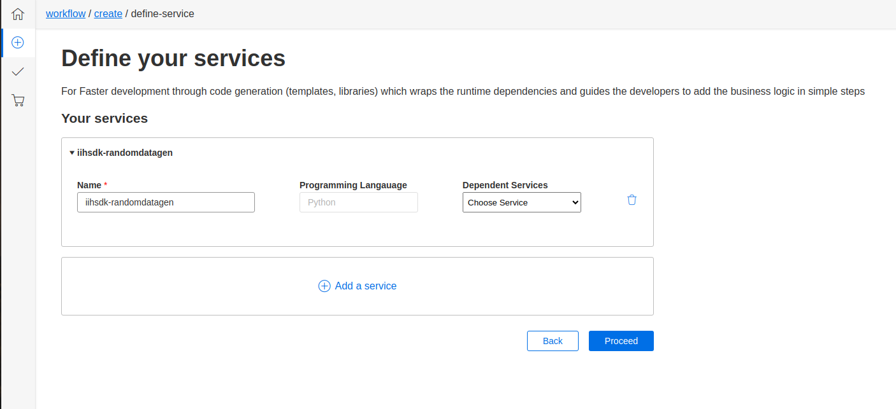
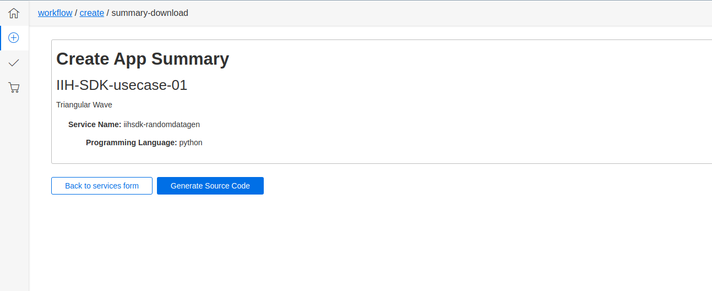
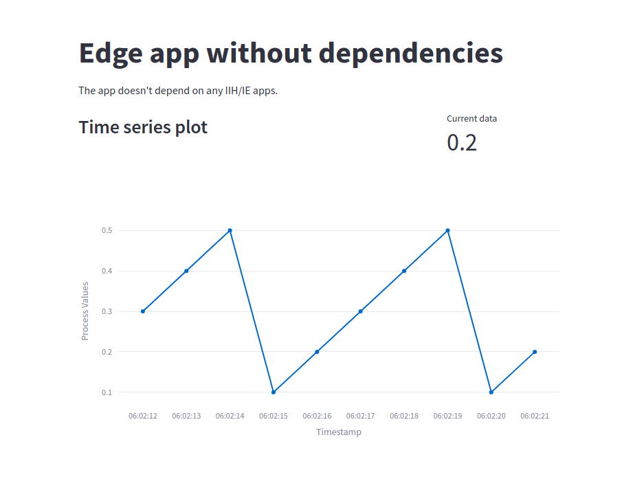

### Example 1 - Triangular Wave using Random Data

Triangular wave using random data - provided by the Development Kit - Create an application without any service and form a **triangular** wave using **streamlit**.

1. Create your application - Enter the name and description of your application. No service is needed in this example. Add service name and move to summary page for reviewing all the details.







2. Download your application - After reviewing it carefully start generating the source code. A zip file will be downloaded. Unzip it and open in VS code.

3. Business Logic - Add business logic to your application for generating triangular wave using random data.

    ===> [Business logic source code for this example can be found here](./001_Example_001_src.md) <===

4. Build the Image - Once the code is ready, build the image. 

    Please navigate to your app repository/directory. To build your service, please append your service name with '_build'. In our example, the service we want to build is 'get-data-from-iih'. So the make command would look like below.

```
make get-data-from-iih_build
```

5. Run your application to test if it works as expected or not - Start the docker compose to check if the application is running on the desired port. You must be in the same path where the docker compose yml file is placed.

```
docker compose up
```

#### Expected Result 

 

Once the local testing and debugging phase is completed, let's deploy your application by generation the .app file which can be sideloaded to IEM. Please go through the below page for steps.

===> [How to Deploy your application](../../001_pages/04_deploy_app/03-Deploy-Workflow.md)  <===

