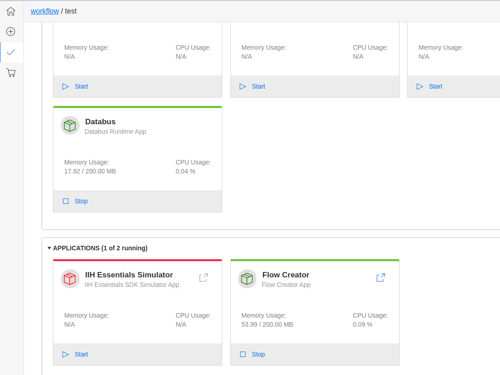
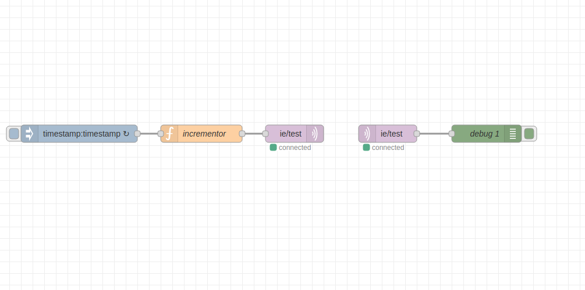
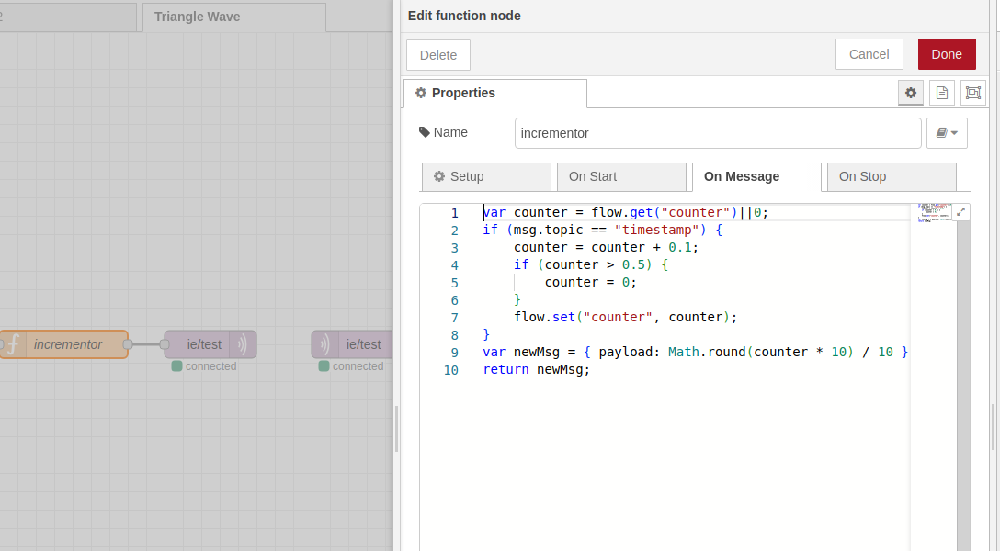
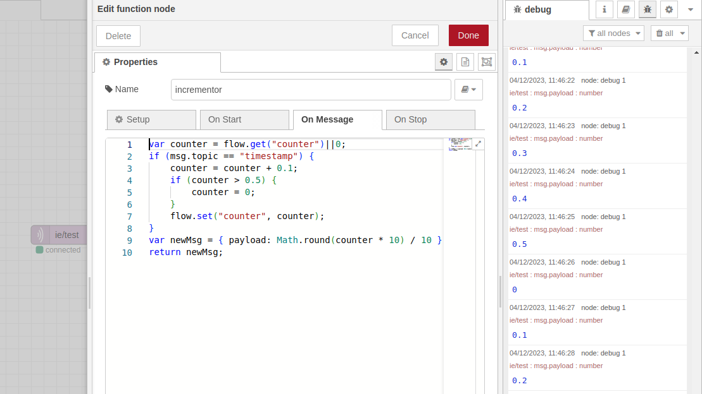
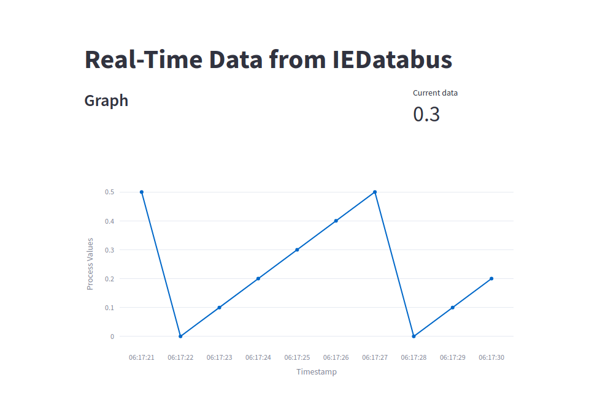

### Example 2 - Triangular wave using Databus Service

Triangular wave using databus as service - provided by the Development Kit - Create an application to form a **triangular** wave using **Databus** and **flow creator** as service and get data through them. The data represented in a triangular wave form is created by using **streamlit**.

1. [Create your application](../../001_pages/02_create_app/01-Create-Workflow.md) - Enter the name and description of your application. Add service and select Databus from the dropdown. Proceed to app summary and review it.
2. Download your application - After reviewing the application, start generating the source code. Once the downlaod is complete you can extract the zip file in your desired location adn open it in VS Code.
3. [Start services for application](../../001_pages/03_test_app/02-Test-Workflow.md) - Go to test workflow and start databus service and flow creator app. Redirect to flow creator using the button and create the flow to receive timestamp. 
   


   - Screen should look like this when you open flow creator
  
   

   - Add timestamp, mqtt-in, mqtt-out, a function and debug.
  
   

   - Configuring the timestamp and set the interval to 1 sec.
     
   

   - Configure the function 
    
   
      Code Snippet - 

      ```
      var counter = flow.get("counter")||0;
      if (msg.topic =="timestamp"){
         counter = counter +0.1;
         if (counter>0.5){
            counter - 0;
         }
         flow.set("counter", counter);
      }
      var newMsg = {payload: Math.round(counter*10)/10}
      return newMsg
      ```

   - Edit the mqtt-broker node
    
   

   - Provide the credentials -  <br>
   `username - edge` <br>
                 `Password - edge`

   

   - Deploy and you should see the timestamp in debug pane.
  
   

4. Business Logic - Add business logic to your application to generate a triangular wave using timestamp data received from the databus and flow creator.

    ===> [Business logic source code for this example can be found here](./002_Example_002_src.md) <===


5. Build the image - Once the code is ready, build the image. 

    Please navigate to your app repository/directory. To build your service, please copy your service name. In our example, the service we want to build is 'get-data-from-iih'. So the make command would look like below.
```
make get-data-from-iih_build
```

6. Run your application to test if it works as expected - Start the docker compose to check if the application is running on the desired port. You must be in the same path where the docker compose yml file is placed.

```
docker compose up
```

#### Expected Result 



After successfull completion. You can expose the port in docker compose yml to build and publish the application in IEM. 


Once the local testing and debugging phase is completed, let's deploy your application by generation the .app file which can be sideloaded to IEM. Please go through the below page for steps.

===> [How to Deploy your application](../../001_pages/04_deploy_app/03-Deploy-Workflow.md)  <===


